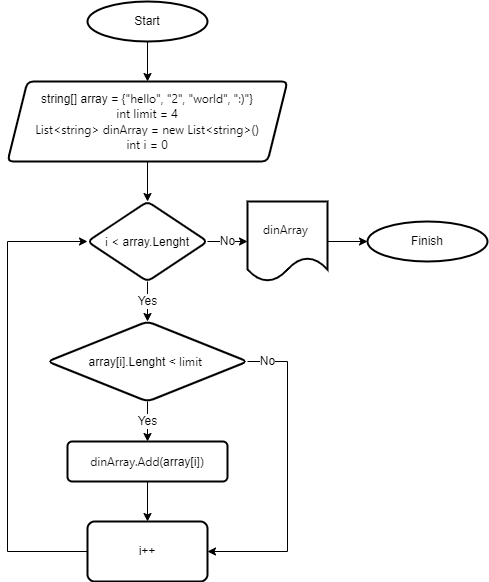

# Контрольная работа

**Описание проверочной работы**: 

1. Создать репозиторий на *GitHub*.
2. Нарисовать блок-схему алгоритма (можно обойтись блок-схемой основной содержательной части, если вы выделяете ее в отдельный метод).
3. Снабдить репозиторий оформленным текстовым описанием решения (файл *README.md*).
4. Написать программу, решающую поставленную задачу.
5. Использовать контроль версий в работе над этим небольшим проектом (не должно быть так что все залито одним коммитом, как минимум этапы 2, 3 и 4 должны быть расположены в разных коммитах).

*****

**Задача**: 

Написать программу, которая из имеющегося массива строк формирует массив из строк, длина которых меньше либо равна 3 символа. Первоначальный массив можно ввести с клавиатуры, либо задать на старте выполнения алгоритма. При решении не рекомендуется пользоваться коллекциями, лучше обойтись исключительно массивами.

*****

**Примеры**:

* ["hello", "2", "world", ":)"] -> ["2", ":-"]
* ["1234", "1567", "-2", "computer science"] -> ["-2"]
* ["Russia", "Denmark", "Kazan"] -> []

*****

**Решение**:

1. Начальный массив *array* задал на старте выполнения алгоритма.
2. Ввел переменную *limit*, равную *4*, чтобы в дальнейшем с помощью неё искать элементы массива размером менее 4 символов. 
3. Далле создал динамический массив *dinArray*. 
4. На следудующем шаге сделал цикл *for*, чтобы пробежаться по массиву *array*, найти в нем элементы менее 4 символов, и сразу же их добавить в динамический массив *dinArray* с помощью оператора *Add()*. 
5. Для вывода массива на консоль использую оператор *string.Join()*. 

*****

В файле на *блок-схеме* изображен **алгоритм** решения задачи:

